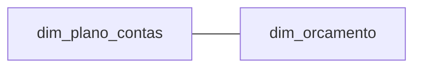
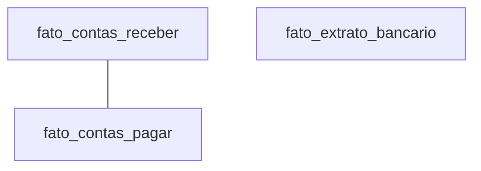
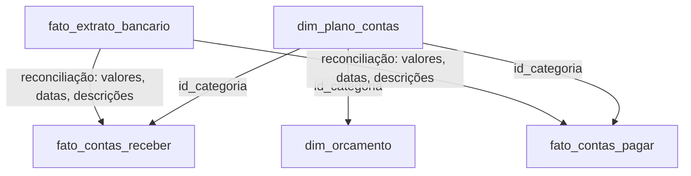
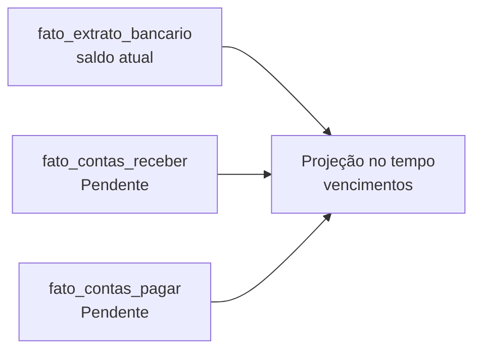
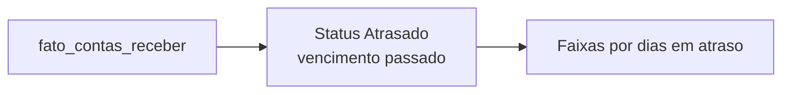
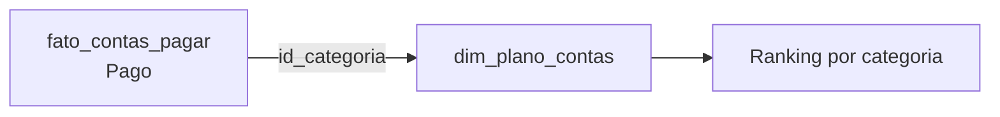
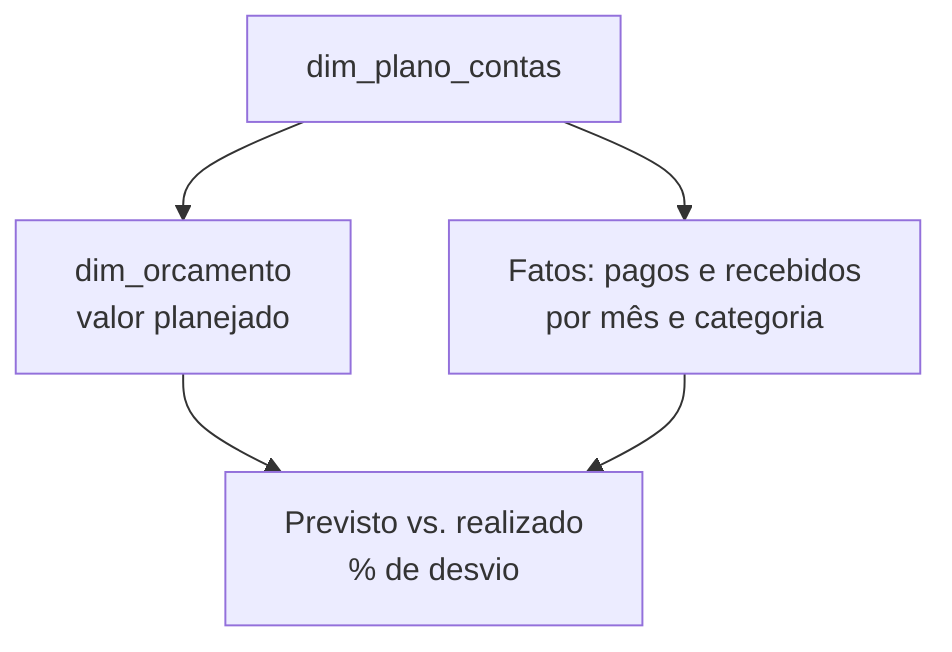
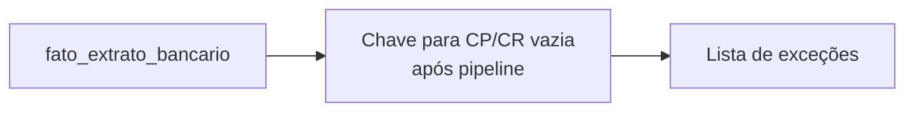
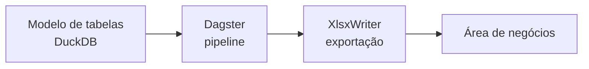

# Tabelas, relações e perguntas de negócio

## 1. Tabelas dimensionais

Para que os números façam sentido e possam ser agrupados de forma lógica, utilizamos duas tabelas dimensionais.

### 1.1 `dim_plano_contas`

- Atua como a espinha dorsal da categorização.
- Contém o detalhamento de cada tipo de movimentação financeira da empresa, classificando se é uma receita ou despesa, seu grupo macro (como "Folha de Pagamento" ou "Custos Operacionais") e sua subcategoria específica.

### 1.2 `dim_orcamento`

- Guarda as metas da empresa.
- Nela, registramos o valor planejado que a empresa espera gastar ou receber para cada categoria do plano de contas dentro de um mês específico.

## 2. Tabelas de fato

A realidade do dia a dia financeiro acontece nas tabelas de fato.

### 2.1 Compromissos: `fato_contas_receber` e `fato_contas_pagar`

- Representam as "promessas" ou expectativas de movimentação; ambas funcionam de maneira espelhada.
- Registram a emissão do compromisso, quem é a contraparte (cliente ou fornecedor), quando o valor deveria ser liquidado (data de vencimento) e qual o valor esperado original.
- Quando o pagamento ou recebimento de fato ocorre, essas tabelas são atualizadas com a data efetiva e o valor real transacionado, mudando seu status de "Pendente" para "Pago" ou "Atrasado".

### 2.2 Movimentação efetiva: `fato_extrato_bancario`

- É a terceira e última peça desse motor.
- Representa a verdade incontestável: o dinheiro que efetivamente entrou ou saiu da conta bancária.
- Cada linha é uma transação pura, com data, valor e a descrição crua gerada pelo banco.

## 3. Como as tabelas se relacionam

### 3.1 Plano de contas, orçamento e fatos (`id_categoria`)

- O relacionamento entre essas tabelas é direto e otimizado para o processamento colunar do DuckDB.
- As tabelas `fato_contas_receber`, `fato_contas_pagar` e `dim_orcamento` se conectam à `dim_plano_contas` através de uma chave comum (`id_categoria`), permitindo que qualquer receita, despesa ou meta seja agrupada sob a mesma visão gerencial.

### 3.2 Extrato, compromissos e reconciliação

- O grande diferencial operacional ocorre na relação entre o extrato e os compromissos.
- O pipeline de reconciliação bancária atua como uma ponte: ele analisa os eventos da `fato_extrato_bancario` e procura correspondências nas tabelas de pagar e receber (cruzando valores, datas e descrições).
- Quando o algoritmo encontra um par, ele preenche uma chave estrangeira no extrato, conectando definitivamente o dinheiro que caiu no banco à nota fiscal que originou aquela cobrança.

## 4. Transformando Dados em Respostas

Com esse modelo estabelecido, as perguntas de negócios mais críticas deixam de ser uma caça manual em planilhas e passam a ser consultas lógicas padronizadas.

### 4.1 Quando o caixa ficará negativo?

- Para projetar o fluxo de caixa, partimos do saldo atual registrado na `fato_extrato_bancario`.
- Em seguida, projetamos para o futuro somando os valores da `fato_contas_receber` que estão com status "Pendente" e subtraindo os valores da `fato_contas_pagar` no mesmo status, alinhando tudo em uma linha do tempo baseada nas datas de vencimento.
- Isso nos dá uma curva de caixa futuro imediata.

### 4.2 Quanto temos em risco de não receber?

- A análise de inadimplência é obtida isolando a tabela `fato_contas_receber`.
- Filtramos os registros onde o status é "Atrasado" e a data de vencimento já passou.
- Subtraindo a data atual da data de vencimento, agrupamos o montante financeiro em faixas de risco (ex: 1 a 30 dias, 31 a 60 dias), gerando a régua de cobrança.

### 4.3 Onde estamos gastando mais?

- O controle de despesas nasce do cruzamento da `fato_contas_pagar` (filtrada apenas para o que já foi "Pago") com a `dim_plano_contas`.
- Agrupando os valores reais pelas categorias do plano, criamos um ranking automático dos maiores ofensores de caixa do mês, evidenciando vazamentos no orçamento.

### 4.4 Estamos dentro do orçamento? (Previsto vs. Realizado)

- Esta visão é construída alinhando a `dim_orcamento` com as movimentações reais.
- Para um determinado mês e categoria, comparamos o "valor planejado" do orçamento contra a soma dos valores efetivamente pagos e recebidos nas tabelas de fato, gerando instantaneamente o percentual de desvio entre a meta e a realidade.

### 4.5 Quais lançamentos no banco estão sem identificação?

- As pendências da reconciliação são encontradas olhando para a `fato_extrato_bancario` e filtrando todas as transações cuja chave de conexão com o contas a pagar ou receber continua vazia após a rotina do pipeline.
- Isso gera uma lista de exceções focada apenas naquilo que requer intervenção humana, zerando o trabalho braçal de "ticar" linhas iguais.

## 5. Orquestração e entrega ao negócio

Ao amarrar essas regras no pipeline orquestrado pelo Dagster, o processamento ocorre em background e o resultado exportado pelo XlsxWriter é a resposta limpa e formatada que a área de negócios precisa para agir.

